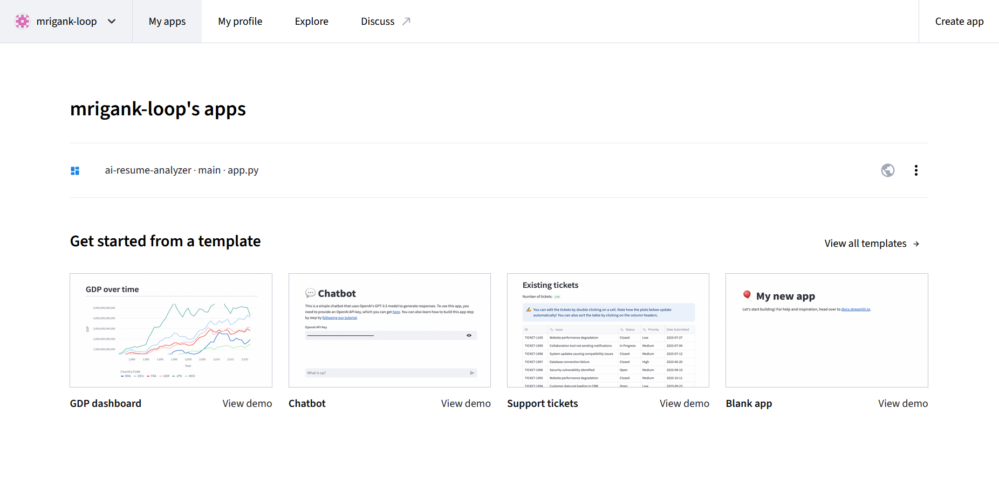

# 📄 AI Resume Analyzer

An AI-powered Resume Analyzer that compares resumes with job descriptions and provides ATS-style insights, keyword analysis, and skill-gap recommendations.


---

## 🚀 Live Demo

https://ai-resume-analyzer-6ybjh3lqy3riddyfk33cpz.streamlit.app/

---

## ✨ Features

* 📄 Upload Resume (PDF)
* 📊 ATS Match Score Calculation
* 🔍 Missing Keyword Detection
* 🛠 Skill Extraction
* 💡 Resume Improvement Suggestions
* ⚡ Fast and Interactive UI
* 🌐 Cloud Deployment with Streamlit

---

## 📸 Screenshots

### Home Page



### Analysis Results


---

## 🏗️ Project Architecture

```text
Resume PDF
     │
     ▼
PDF Text Extraction
     │
     ▼
NLP Processing
     │
     ├── ATS Score
     ├── Skill Detection
     ├── Missing Keywords
     └── Suggestions
     │
     ▼
Streamlit Dashboard
```

---

## 🛠️ Tech Stack

| Technology   | Purpose              |
| ------------ | -------------------- |
| Python       | Core Programming     |
| Streamlit    | Web Application      |
| PDFPlumber   | PDF Text Extraction  |
| Scikit-Learn | Text Similarity      |
| Pandas       | Data Handling        |
| NumPy        | Numerical Operations |

---

## ⚙️ Installation

Clone the repository:

```bash
git clone https://github.com/Mrigank-loop/AI-Resume-Analyzer.git
cd AI-Resume-Analyzer
```

Install dependencies:

```bash
pip install -r requirements.txt
```

Run locally:

```bash
streamlit run app.py
```

---

## 🎯 How It Works

1. Upload a resume in PDF format.
2. Paste a job description.
3. Extract text from both documents.
4. Compare using NLP similarity techniques.
5. Generate ATS score and recommendations.

---

## 📈 Future Enhancements

* AI-powered Resume Rewriting
* Resume Ranking System
* Multi-Resume Comparison
* Job Recommendation Engine
* Downloadable PDF Reports

---

## 👨‍💻 Author

**Mrigank Singhaniya**

GitHub: https://github.com/Mrigank-loop

LinkedIn:https://www.linkedin.com/in/mrigank-shanker-712bb4331/

---

## ⭐ Support

If you found this project useful:

⭐ Star the repository

🍴 Fork the project

📢 Share it with others

---

### Built with Python, Streamlit, and Machine Learning 🚀